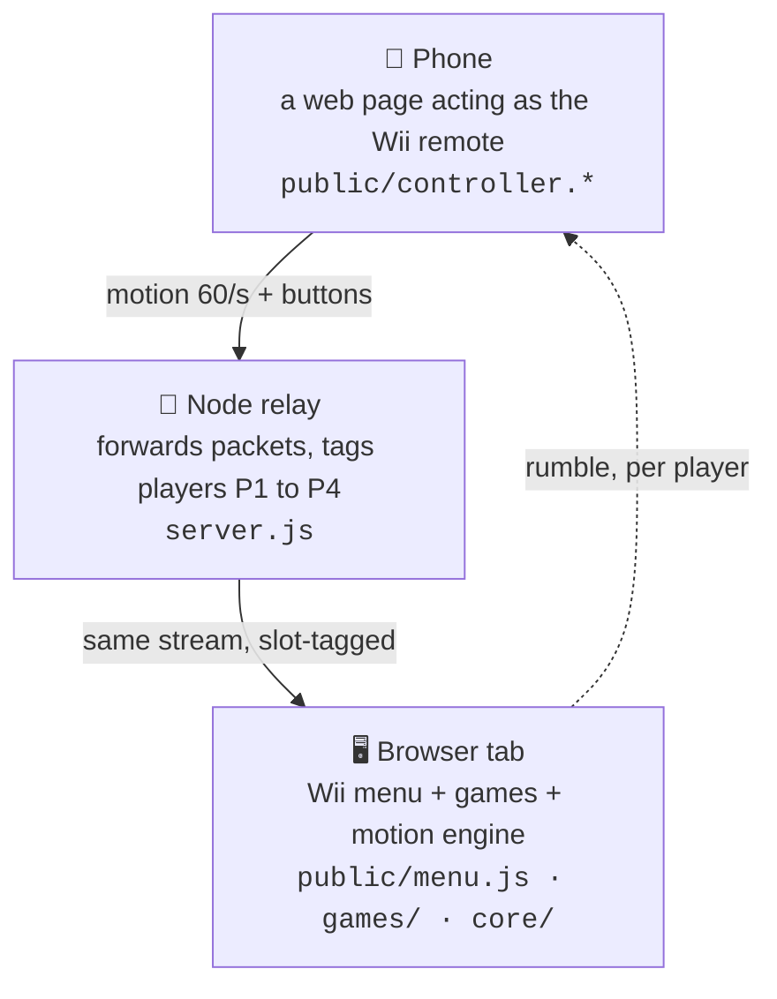

# 🕹 OpenWii

Your phone is the controller. Your computer runs the games.

Scan a QR code to turn your phone into a motion controller—no app or extra
hardware required. Up to four phones can join the same computer; player counts
vary by game.

## Quick start

Requires **Node.js 22+**, **OpenSSL**, a computer browser with WebGL 2, and a
motion-capable phone browser on the **same Wi-Fi**.

```bash
git clone https://github.com/pattssun/OpenWii.git
cd OpenWii
npm ci
npm start
```

1. Open **https://localhost:8443/** on your computer. On macOS, Chrome opens
   automatically.
2. Scan the launcher's QR code with your phone. Accept the local self-signed
   certificate, tap **Enable motion sensors**, and allow access.
3. Choose a game and follow its controls. Stop the server with **Ctrl+C**.

**Phone motion requires HTTPS.** Use the QR code or the terminal's **Phone remote**
address, not `localhost` on your phone. OpenWii is designed for shared local-network
play.

## Games

| Game | How to play | Players |
| --- | --- | --- |
| 🏎️ **[Mario Kart](games/mario-kart/README.md)** | Hold your phone sideways to steer, drift, boost and use items. The linked guide covers controls and optional demo assets. | 1 human + 7 CPU racers |
| 🍉 **[Fruit Ninja](games/fruit-ninja/)** | Swing to slice fruit, dodge bombs and build combos. | Up to 4 |
| 👾 **[Alien Attack](games/alien-attack/)** | Tilt to fly and press A to fire. | 1 |
| 🎯 **[Shooting Range](games/shooting-range/)** | Point and press A to hit targets against the clock. | 1 |
| 🎨 **[Sketch](games/drawing/)** | Point and press A to draw. Choose colors, brushes and an eraser. | 1 |

## How it works



A real Wii needs an IR sensor bar to know where the remote points; OpenWii replaces it with pure software. The
engine learns each phone's gyro axis conventions from its own data at runtime
(they genuinely differ between devices), heals drift back toward the true pose
between swings, and dead-reckons the cursor slightly ahead of the packet
stream so it never feels laggy.

## Troubleshooting

- **Cannot connect:** check both devices are on the same Wi-Fi, allow Node.js
  through the firewall, and avoid guest networks that isolate devices.
- **Buttons work but motion does not:** check HTTPS and motion permissions. If
  the terminal reports an HTTP fallback, install OpenSSL and restart.
- **Black screen:** enable WebGL 2 / hardware acceleration in the computer browser.
- **No sound:** click the game to unlock audio and check its mute control.

Set `PORT` to use another port, or `NO_OPEN=1` to skip auto-opening Chrome.

## License

[MIT](LICENSE) for the software. This independent fan project is not
affiliated with or endorsed by Nintendo.
